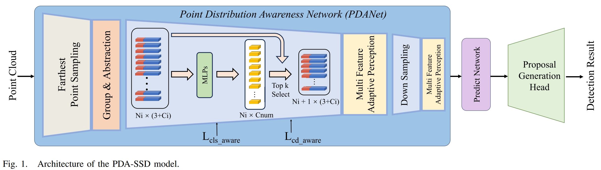

[](https://ieeexplore.ieee.org/document/10649613)

# PDANet: Point Distribution Awareness for 3-D Object Detection From LiDAR Point Clouds 

This is the official implementation of ***PDA-Net-SSD*** ,  we propose a point distribution awareness network (PDANet) that emphasizes the structural distribution of objects, to enhance the extraction of positional, geometric, and semantic features. 

<p align="center">  </p>


## Getting Started
### Installation

a. please refer to
https://github.com/yifanzhang713/IA-SSD
and 
https://github.com/open-mmlab/OpenPCDet/blob/master/docs/INSTALL.md

b. My installation environment

We have tested this project with the following environments:
* Ubuntu 20.04
* Python = 3.7.13
* PyTorch = 1.8.1
* CUDA = 11.1
* spconv = 2.1


c. Install `pcdet` toolbox.
```shell
pip install -r requirements.txt
python setup.py develop
```


### Quick Inference

```shell
cd tools 
# To achieve fully GPU memory footprint (NVIDIA RTX2080Ti, 11GB).
python test.py --cfg_file cfgs/once_models/PDA-SSD.yaml --batch_size 2 \
    --ckpt ***.pth 


### Training
The configuration files are in ```tools/cfgs/kitti_models/PDA-SSD.yaml``` and ```tools/cfgs/once_models/PDA-SSD.yaml```.

python train.py --cfg_file cfgs/once_models/PDA-SSD.yaml  --batch_size 2 


## Citation 
If you find this project useful in your research, please consider citing:

```

@ARTICLE{10649613,
  author={Tang, Miao and Yu, Dianyu and Hu, Qingyong and Dai, Wenxia and Xiao, Wen},
  journal={IEEE Transactions on Geoscience and Remote Sensing}, 
  title={PDANet: Point Distribution Awareness for 3-D Object Detection From LiDAR Point Clouds}, 
  year={2024},
  volume={62},
  number={},
  pages={1-15},
  keywords={Feature extraction;Point cloud compression;Three-dimensional displays;Semantics;Adaptation models;Encoding;Proposals;3-D object detection (3DOD);plug-and-play module;point clouds;small object},
  doi={10.1109/TGRS.2024.3450735}}
```

## Acknowledgement
-  This work is built upon the `OpenPCDet` (version `0.5`) and `IA-SSD`.


## License

This project is released under the [Apache 2.0 license](LICENSE).


## Related Repos
1. [Not All Points Are Equal: Learning Highly Efficient Point-based Detectors for 3D LiDAR Point Clouds](https://github.com/yifanzhang713/IA-SSD) 
2. [OpenPCDet](https://github.com/open-mmlab/OpenPCDet) 
3. [CasA: A Cascade Attention Network for 3D Object Detection from LiDAR point clouds](https://github.com/hailanyi/CasA)
4. [Center-based 3D Object Detection and Tracking](https://github.com/tianweiy/CenterPoint) 